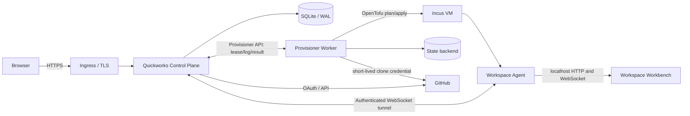

# Quickworks 工作区管理器方案

> 调研与设计日期：2026-07-30

## 1. 结论

建议实现一个小型控制面，不直接复刻 Coder：

- 一个 Web/API 服务负责 GitHub 登录、白名单、工作区列表、生命周期 API 和反向代理。
- 一个 Provisioner Worker 串行执行 OpenTofu，并将构建日志和状态回写数据库。
- 工作区基础设施由版本化 OpenTofu 模板定义；控制面配置默认模板和多个命名模板，创建请求可用 `?t={template_name}` 选择允许的模板。
- 每个工作区保留独立的持久卷和独立的 OpenTofu state。停止时删除计算容器但保留卷，删除时才执行完整 destroy。
- 工作台服务和 `quickworks-agent` 运行在工作区环境内；agent 主动连接控制面，控制面经认证隧道转发 `/w/{workspace_id}/...`。
- GitHub OAuth 同时用于登录和以当前用户身份克隆仓库。clone 凭据经控制面加密后通过 agent 通道传递，不进入 OpenTofu state。

这是一个可先在单机上稳定运行、再逐步扩展的边界。MVP 实现精简的 agent WebSocket 隧道，但不实现 Coder 的 DERP/P2P 网络、通用模板市场、组织/RBAC、预构建和多区域调度。

## 2. 需求映射

| 入口 | 行为 | 建议 HTTP 语义 |
| --- | --- | --- |
| `GET /` | 工作区管理面板 | 已登录用户的列表、状态、启动、停止、删除 |
| `GET /templates` | 工作区模板列表 | 展示模板的默认项、计算规格和 provisioner label 要求 |
| `GET /w/` | 创建空工作区 | 仅接受浏览器顶层导航，创建后 `303` 到工作台 |
| `GET /github/{owner}/{repo}` | 从 GitHub 仓库创建 | 校验仓库并展示确认页 |
| `POST /api/workspaces` | 创建并克隆仓库 | body 包含规范化后的 repo 信息 |
| `ANY /w/{workspace_id}/...` | 工作区工作台 | 运行中反代 HTTP/WebSocket；启动中显示 SSE 构建日志并轮询状态，停止时显示启动入口 |

`GET /w/` 是有意设计的便捷创建入口。它只接受已登录用户的浏览器顶层 HTML 导航，并同时要求：

- `Accept` 包含 `text/html`。
- `Sec-Fetch-Mode: navigate`。
- `Sec-Fetch-Dest: document`。
- `Sec-Fetch-Site` 为 `none` 或 `same-origin`；拒绝 `cross-site`。
- `Purpose` 和 `Sec-Purpose` 均不包含 `prefetch`。

这些 Fetch Metadata 请求头可以区分正常地址栏/链接导航与常规 AJAX，但请求头仍可由非浏览器客户端伪造，不能代替登录鉴权、资源归属和限流。服务端在一个 SQLite 事务中创建 workspace 与短期幂等记录，同一用户短时间内的重复导航返回同一个 workspace；随后立即响应 `303 See Other` 到 `/w/{workspace_id}`，刷新工作台不会再次触发创建。不满足导航条件的请求不得降级创建，返回 `403` 或 `406`。

`GET /github/{owner}/{repo}` 仍展示仓库信息并通过带 CSRF 防护的 POST 创建，因为它还需要使用登录用户的 GitHub 权限检查仓库、分支和规范化结果。

## 3. 参考项目结论

### Coder

值得复用的是模型，而不是全部实现：

- 模板是标准 Terraform，底层资源可来自 Docker、Kubernetes 或云厂商。
- Coder 将每次 create/start/stop/delete 视作一次 workspace build，由 provisioner 执行 Terraform。
- `coder_workspace.start_count` 在运行时为 `1`、停止时为 `0`。模板把它赋给计算资源的 `count`，从而停止时销毁计算但保留未绑定该条件的持久资源。
- 持久资源必须使用不可变 workspace ID 命名，不能依赖可修改的展示名称；否则模板变化或重命名可能误删数据。Quickworks 的 workspace ID 本身是创建时生成且永不修改的人类可读 pet name。
- agent 负责连接工作区、执行初始化和暴露 app。Quickworks 复用“agent 主动连接控制面”的模式，但只实现状态上报与工作台 WebSocket 隧道，不复制完整 DERP/P2P 网络。

隧道协议在 agent 与控制面两端均将单帧读取上限设为 16 MiB，以容纳工作台的静态资源和 10 MiB 以内的代理 HTTP 响应；超过该限制的响应应由后续流式协议处理，不能无限制提高内存上限。

### DevPod

值得借鉴 provider 与开发环境规范分离：provider 决定工作区跑在哪里，Dev Container 决定开发环境是什么。Quickworks 后续可支持仓库内 `.devcontainer/devcontainer.json`，但 MVP 应先使用固定镜像，避免把 devcontainer 构建、Docker-in-Docker 和供应链风险一起引入。

### Gitpod / Ona

仓库上下文 URL 和临时工作区体验与本需求接近，但完整 Gitpod 控制面、预构建和 Kubernetes 调度远超所需。其 OpenVSCode Server 可作为工作台兼容性测试对象，但如果已有类似 VS Code Agents Window 的服务，应优先复用现有服务。

### Daytona

其 control plane / compute plane 分层值得参考，但 2026 年公开仓库已声明不再维护，核心开发转为私有，不适合作为自托管基础依赖。可以借鉴 SDK/API 化的生命周期边界，不建议 fork。

### OpenTofu

建议用 OpenTofu 而非直接嵌入 Terraform 库：CLI 自动化接口成熟、MPL 许可清晰，并支持 plan 文件、状态锁和 JSON 事件输出。执行流程应为 `init -> plan -out -> apply plan`，不能直接对用户请求执行无审计的 `apply -auto-approve`。

## 4. 总体架构



MVP 将 Control Plane、Provisioner 和 Workspace Agent 编译成同一个纯 Go 二进制，以不同子命令启动：

```text
quickworks server --config /etc/quickworks/config.yaml
quickworks provisioner --config /etc/quickworks/config.yaml
quickworks agent
```

Workbench 是独立项目，发布为平台相关的 tar.gz，不编译或嵌入 Quickworks。控制面向 agent 提供 bundle URL、SHA-256、版本和入口路径，agent 下载并校验后安装。OpenTofu/provider 可能卡住、耗尽内存或执行不可信模板，因此 provisioner 不应与 server 在同一进程运行；它可以部署在同一宿主机，也可以部署到能够访问 Incus API 的独立主机。Workspace 内 systemd 只管理 agent，agent 解包后以低权限子进程启动和监管外部 workbench。

### 推荐技术栈

- 后端：Go，适合反向代理、WebSocket、长任务和单二进制部署。
- 前端：服务端渲染 HTML + 少量 HTMX/原生 JavaScript；管理面板无需 SPA。
- 数据库：GORM + SQLite，使用 `gorm.io/gorm` 和纯 Go Dialector `github.com/glebarez/sqlite`（底层为 modernc.org/sqlite）；启用 WAL、外键约束和 busy timeout，数据库文件位于持久磁盘。
- IaC：OpenTofu CLI，固定允许的 provider 和模板版本。
- 队列：build 记录保存在 SQLite。控制面在短写事务中用条件 `UPDATE ... RETURNING` 为 provisioner 签发 lease；远程 provisioner 只通过内部 API 领取任务、续租和回写结果，不直接连接数据库。
- 入口：Caddy、Traefik 或现有 ingress 终止 TLS，Quickworks 只信任显式配置的代理网段。

SQLite 方案限定为单个 Control Plane 实例。WAL 允许读取与写入并行，但 SQLite 仍然只有一个 writer。数据库文件只能由控制面挂载在本地持久磁盘；即使 provisioner 跨主机部署，也不得通过 NFS、SMB 或分布式文件系统共享 SQLite。多控制面副本或更高写入吞吐需要迁移到 PostgreSQL。

不引入 `gorm.io/driver/sqlite` 或 `mattn/go-sqlite3`。控制面、Provisioner 和 agent 均必须能在 `CGO_ENABLED=0` 下构建，无需 C 编译器或系统 SQLite。Workbench 由其独立项目定义构建约束。连接 DSN 使用 pure-Go 驱动支持的 `_pragma` 参数，对每个新连接设置 SQLite 参数：

```go
dsn := "file:" + databasePath +
  "?_pragma=foreign_keys(1)" +
  "&_pragma=journal_mode(WAL)" +
  "&_pragma=busy_timeout(5000)" +
  "&_txlock=immediate"

db, err := gorm.Open(sqlite.Open(dsn), &gorm.Config{
  TranslateError: true,
})
```

底层 `sql.DB` 设置有限连接池，例如 `SetMaxOpenConns(4)`、`SetMaxIdleConns(4)` 和连接生命周期。不要使用 `:memory:`；测试使用 `file:test-name?mode=memory&cache=shared`，并保证每个测试名称独立。

CI 和发布构建固定执行 `CGO_ENABLED=0 go test ./...` 与 `CGO_ENABLED=0 go build ./...`，防止后续依赖意外重新引入 CGO。`github.com/glebarez/sqlite` 的发布节奏慢于 `modernc.org/sqlite`；依赖版本必须由 `go.mod`/`go.sum` 固定并经过上述测试，不直接用 `replace` 强行升级其底层 SQLite。若后续必须使用新版 SQLite 特性，应先增加兼容测试，再升级或维护独立 GORM Dialector。

### 项目目录结构

采用一个 Go module、一个入口包和按运行角色分隔的 `internal` 包。建议落地结构：

```text
quickworks/
├── cmd/
│   └── quickworks/
│       └── main.go                 # 仅解析 server/provisioner/agent 子命令
├── internal/
│   ├── app/
│   │   ├── server.go               # 组装控制面依赖和生命周期
│   │   ├── provisioner.go          # 组装 worker 依赖和生命周期
│   │   └── agent.go                # 组装 workspace agent
│   ├── server/
│   │   ├── auth/                   # GitHub OAuth、UID 白名单、session
│   │   ├── workspace/              # 工作区状态机和幂等命令
│   │   ├── agenthub/               # agent 注册、连接表和 tunnel 调度
│   │   ├── proxy/                  # /w/{id} HTTP/WebSocket 代理
│   │   ├── web/                    # 管理面板 handler 和 view model
│   │   └── router.go
│   ├── provisioner/
│   │   ├── worker.go               # SQLite build queue 消费循环
│   │   ├── executor.go             # plan/apply/destroy 编排
│   │   ├── opentofu/               # 外部 OpenTofu CLI 适配
│   │   ├── state/                  # workspace state 存储接口与本地实现
│   │   └── redact/                 # 事件日志脱敏
│   ├── agent/
│   │   ├── client.go               # 注册、重连、心跳和状态上报
│   │   ├── identity.go             # Ed25519 持久身份
│   │   ├── bundle.go               # 下载、校验和原子安装
│   │   ├── supervisor.go           # 低权限启动、监管外部 workbench
│   │   ├── tunnel.go               # stream 多路复用和反向代理
│   │   └── health.go               # 本地 workbench 健康检查
│   ├── protocol/
│   │   ├── agent/                  # server 与 agent 共享的帧、版本和错误码
│   │   └── provisioner/            # server 与 worker 共享的 lease/API 类型
│   ├── config/                     # YAML schema、默认值和严格校验
│   ├── database/
│   │   ├── database.go             # GORM/纯 Go SQLite 初始化
│   │   ├── model/                  # 持久化模型，不承载业务状态机
│   │   ├── query/                  # 原子领取等显式 SQL
│   │   └── migration/              # 版本化 migration runner
│   ├── github/                     # OAuth/API client 与 clone 凭据交换
│   ├── observability/              # 结构化日志、指标和 request ID
│   └── buildinfo/                  # version、commit、协议版本
├── migrations/
│   ├── 000001_initial.up.sql
│   └── 000001_initial.down.sql
├── web/
│   ├── templates/                  # server-side HTML templates
│   └── static/                     # 管理面板 CSS/JS
├── assets/
│   ├── embed.go                    # bootstrap/startup 模板和发布资源的 embed.FS
│   ├── workspace-startup.sh.tmpl
│   └── workspace-bootstrap.sh
├── config.example.yaml
├── go.mod
├── go.sum
├── Makefile
└── ARCHITECTURE.md
```

`cmd/quickworks/main.go` 不包含业务逻辑，只选择子命令并调用 `internal/app`。`internal/app` 是 composition root；各角色包不得互相导入，例如 `agent` 不得依赖 `database`、`server` 或 `provisioner`，workspace 中的二进制即使包含这些代码，也无法在没有控制面配置和本地凭据时获得对应权限。

共享代码只在存在稳定协议时下沉：server 与 agent 共享 `internal/protocol/agent`，所有角色共享 `config`、`observability` 和 `buildinfo`。不要创建宽泛的 `common`、`utils` 或 `helpers` 包。面向外部系统的依赖以小接口定义在使用方包内，具体实现由 `internal/app` 注入。

当前 Workbench 使用独立项目 `hempflower/vscode-agents-server` 的正式发行包。默认版本为 `v4.131.1`，Linux amd64 URL 为 `https://github.com/hempflower/vscode-agents-server/releases/download/v4.131.1/vscode-agents-server-4.131.1-linux-amd64.tar.gz`，SHA-256 为 `7a70cd61c4d95181931f2561973f7a2f5f05e49cff890eac5a81d04d7206d12e`。归档包含唯一顶层目录 `vscode-agents-server-4.131.1-linux-amd64/`，入口相对该目录为 `bin/vscode-agents-server`；入口依赖同目录的 bundled Node、`node_modules`、VS Code 和静态资源，安装时必须保留完整目录树。

Workbench tar.gz 不进入 Quickworks 源码、构建上下文或二进制。控制面从 YAML 读取 URL、SHA-256、版本和入口相对路径，并在 agent 注册响应中下发；四项均为必填，控制面启动时缺失或格式错误应 fail-fast。该模式允许 Workbench 独立于 Quickworks 升级。每个平台使用独立 URL 和摘要，不能把 amd64 包下发给 arm64 agent。

Quickworks 只嵌入自身运行所需的 `migrations`、控制面 HTML/静态文件和 workspace startup/bootstrap；OpenTofu 模板不进入 Quickworks 源码、构建上下文或二进制。每个模板作为独立制品打包、发布并解压到具备相应 label 的 provisioner 主机，运行时复制到每个 build 的临时目录。Quickworks 发布包只包含 `quickworks`；workspace 内 systemd 只执行 `quickworks agent`，agent 负责获得、安装和启动外部 `workbench`。

测试与被测包并置为 `*_test.go`；跨模块场景放在根目录 `integration/`，覆盖 SQLite migration/队列领取、agent tunnel、Incus/OpenTofu 生命周期。需要 Incus daemon 或 GitHub 的测试使用显式 build tag，默认 `CGO_ENABLED=0 go test ./...` 不依赖外部服务。

## 5. 控制面模块

### Auth

1. `/auth/github` 生成带 PKCE、随机 `state` 和 `nonce` 的授权请求。
2. callback 换取 token 后调用 GitHub `GET /user`。
3. 以 GitHub 数字 `id` 判断 `auth.allowed_user_ids`，不要用可变 login 名。
4. 不在白名单则拒绝并立即清除上游 token。
5. 签发 24 小时、`HttpOnly; Secure; SameSite=Lax` 的浏览器 JWT；JWT 仅包含内部用户 ID、签发/过期时间、受众和随机 ID，并由从 `server.secret_key_file` 派生的独立 HMAC 密钥签名。

允许 UID 为数字或字符串形式解析，但内部统一保存为 64 位整数。配置热加载时，已被移出白名单的用户应在下一次请求失效。

### Workspace Service

负责输入校验、状态机和幂等命令，不直接调用 OpenTofu。建议状态：

```text
pending -> starting -> running -> stopping -> stopped
                      \-> failed <-/
任意稳定状态 -> deleting -> deleted
```

每个工作区同一时刻只允许一个 build。API 接受 `Idempotency-Key`，避免双击创建两个工作区。

### Provisioner Worker

Provisioner 可以与控制面同宿主机或分开部署，但始终通过控制面内部 API 领取 build，不直接打开 SQLite。每个实例配置稳定的 `worker_id`、独立 bearer token 和一组 labels；控制面只保存 token 哈希。API 必须使用 TLS，token 只放在 `Authorization` header，不写 URL 或日志。

模板在控制面 YAML 中以不可变 `name` 注册，指定一个或多个必需 labels，并配置一个默认模板。`GET /w/?t=aliyun-4c8g` 或创建 API 的 `template` 字段只能选择已注册名称；没有 `t`/`template` 时使用默认模板。labels 是精确的小写标识，模板的 `required_labels` 是 AND 关系：例如 `['home', 'larger']` 只能由同时声明 `home` 和 `larger` 的 provisioner 领取；`['aliyun']` 只能由带 `aliyun` 的 provisioner 领取。控制面在 lease 领取 SQL 中同时筛选 build 的模板要求与 worker labels；不匹配的 worker 返回空 lease，不能领取后再跳过。

控制面原子地将 queued build 更新为 running，写入 `claimed_by`、不可猜测的 `lease_id` 和 `lease_expires_at` 后返回任务。Provisioner 执行期间定期续租，并携带 `lease_id` 上传日志和最终结果；控制面只接受当前未过期 lease 的写入。lease 过期后 reconciler 先检查 OpenTofu/state 和真实资源，再决定重试，不能直接并发 apply。

Worker 使用独立临时目录执行：

1. 检查 `template_dir/main.tf` 存在并准备输入参数。
2. 获取该工作区的分布式锁。
3. 准备只读模板和生成的非敏感变量文件。
4. `tofu init -input=false`。
5. `tofu plan -input=false -lock-timeout=30s -out=plan.bin`。
6. 保存 plan 摘要，检查是否出现意外的持久卷 replace/delete。
7. `tofu apply -input=false plan.bin`。
8. 读取约定 outputs：agent ID 和资源 ID。
9. 等待 workspace agent 注册并报告工作台 ready，更新状态。

日志使用 OpenTofu `-json` 事件流解析后存储，并在 UI 中流式显示。敏感环境变量、Authorization URL 和 provider 返回的 sensitive 字段必须脱敏。

同宿主机部署也沿用这套 API，减少两种执行路径。跨主机时 provisioner 必须自行访问 Incus endpoint，并将 `state_dir` 放在该主机的持久磁盘；若需要 worker 故障转移，则改用带锁的远程 state backend。控制面不代理 Incus socket、OpenTofu 子进程或 state 文件。

### Workspace Agent

每个运行中的 workspace 启动一个 `quickworks-agent`。agent 与仓库代码属于不同信任边界：二进制来自管理员固定镜像，配置只来自 `.tf`，进程使用独立用户运行，仓库脚本不能修改二进制或读取长期控制面凭据。

agent 负责：

- 获取、安装并监管外部 `workbench` 子进程；异常退出时采用有上限的指数退避重启，持续失败则上报 degraded。
- 主动连接控制面 `/api/agent/connect`，因此工作区无需暴露入站端口。
- 定期上报 `starting`、`ready`、`degraded` 状态、工作台健康状态、启动时间和有限资源指标。
- 将控制面下发的 HTTP/WebSocket 流量转发到本地工作台，例如 `http://127.0.0.1:3000`。
- 上报结构化启动日志和工作台不可用原因；不采集仓库文件内容或任意进程环境。
- 收到 drain 命令后停止接受新隧道，等待活动连接结束，供 stop/delete 使用。
- 根据控制面下发的版本策略更新 Workbench bundle。Workspace bootstrap 只负责一次性系统初始化，不承担更新职责；agent 在 Workbench 就绪后每 15 分钟检查控制面发布的 Quickworks agent bundle 摘要，下载并校验变化的归档，以原子替换自身二进制后退出，由 systemd 重启。

Agent 注册响应必须携带 `workbench_bundle_url`、`workbench_bundle_sha256`、`workbench_version` 和 `workbench_entrypoint`。Agent 仅接受 HTTPS URL，通过临时文件下载并限制响应大小，校验控制面在认证响应中给出的 SHA-256 后，再解包到 `/var/lib/quickworks-agent/workbench/versions/{sha256}/`。任一字段缺失、下载失败或摘要不匹配时，agent 上报 degraded 并保持连接，不启动旧版本或未知 Workbench。

解包必须拒绝绝对路径、`..`、设备文件、FIFO、越出唯一顶层目录的 hardlink/symlink，以及不在该顶层目录内的入口。当前发行包包含 `node_modules/.bin` 下的相对 symlink，因此允许 symlink，但其逐级解析结果必须仍在版本目录内。校验后将版本目录设为 root-only 且不可由 workbench 修改。`current` 软链接原子切换到完整安装的新版本，最多保留当前版本和一个可回滚版本。生产 Linux 中 agent 由 systemd 以 root 启动，仅用于读取 root-only agent 身份、安装 bundle 和将 `/var/lib/quickworks-agent/workbench/current/vscode-agents-server-4.131.1-linux-amd64/bin/vscode-agents-server` 降权到 `workspace` UID/GID；该用户使用 Bash，家目录为 `/home/workspace`，并将该目录作为进程 `HOME`。`workspace` 具有免密 `sudo`，可管理该 VM；因此仓库代码等同于该 VM 的 root 权限。workbench 仍不能直接读取 agent 状态目录或 `/etc/quickworks/agent.env`。

`vscode-agents-server` 强制要求 `--agents-byok-config`，缺失时会立即退出。控制面配置 `workbench.byok_config_file` 指向控制面主机上的管理员 catalogue；控制面启动时读取并严格校验。远程 workspace 不读取控制面文件路径。

Workbench 使用通用的进程环境传递机制，BYOK 是该机制的一个消费者：

1. `workbench.env_file` 指向控制面主机上由管理员维护的 dotenv 文件，例如 `.secrets/workbench.env`。控制面解析常规 `KEY=VALUE`、空行和 `#` 注释，不通过 shell `source` 执行文件内容。
2. 控制面读取 catalogue 和 dotenv 内容。Agent 完成注册后，通过已认证的 TLS WebSocket 控制连接领取二者，并分别写入 `/etc/quickworks/workbench/byok.json` 和 `/etc/quickworks/workbench.env`；env 文件权限为 `0600`。
3. Agent 启动 `vscode-agents-server` 时读取 `/etc/quickworks/workbench.env` 并合并到子进程环境。该文件可以包含 `DEEPSEEK_API_KEY` 或其他 Workbench 所需变量，不区分普通变量和机密变量。
4. Quickworks 不把 env 值写入常规日志或 API 响应。配置变化后重新下发文件并重启 `vscode-agents-server` 即可。

`vscode-agents-server` 启动入口会根据 catalogue 的 `apiKeyEnv` 获取 `DEEPSEEK_API_KEY`，并由其自身负责后续 Agent Host 的 BYOK 传递。Quickworks 不额外实现逐变量加密、一次性 secret payload 或内存清零。

当前 provider 使用 native `deepseek` transport，base URL 为 `https://api.deepseek.com/anthropic`；Workbench 向 `${baseUrl}/v1/messages` 发送请求。模型 `deepseek-v4-flash` 声明 `1000000` token context window 和 `65536` token 最大输出。Agent 启动命令固定为：

```text
bin/vscode-agents-server \
  --auth none \
  --bind-addr 127.0.0.1:3000 \
  --disable-update-check \
  --agents-byok-config /etc/quickworks/workbench/byok.json \
  --user-data-dir /workspace/.quickworks/user-data \
  --extensions-dir /workspace/.quickworks/extensions \
  /workspace
```

`--auth none` 只允许与 loopback 绑定同时使用；浏览器访问仍由控制面的 session、workspace ownership 和 agent tunnel 鉴权。Workbench 自更新检查关闭，版本完全由控制面和 agent 管理。

Agent 捕获 SIGTERM 后先停止接受新 tunnel、通知 workbench 子进程退出，超时后终止整个子进程组，再关闭控制连接。Agent 不把 workbench 的快速崩溃当成自身崩溃，避免 systemd 与内部 supervisor 形成双重重启循环。

MVP 使用一条出站 TLS WebSocket 作为控制连接，在其上实现带 `stream_id` 的多路复用帧：`register`、`heartbeat`、`status`、`open`、`data`、`close` 和 `drain`。每个 stream 都有窗口与最大缓冲区，避免慢浏览器耗尽 agent 内存。后续流量较大时可改为 mTLS HTTP/2 或 QUIC，外部 Workspace Proxy API 不需要变化。

### Agent 注册与认证

1. 开发环境中，start build 前控制面生成仅绑定当前 workspace/build、有效期一年的可重复 enrollment token，只在数据库保存哈希。
2. enrollment token 包含在 `startup_script` sensitive 变量中。`sensitive` 只隐藏 CLI 输出，Provider 仍可能将脚本写入 state，因此 state 文件按密钥材料保护；生产环境应改回短期一次性 token。
3. agent 首次启动生成 Ed25519 密钥对，用 enrollment token 提交公钥、workspace ID 和 build ID。
4. 控制面核对 workspace/build/token 后签发短期 agent session；开发环境允许同一 token 用于 agent 重启注册。
5. 私钥保存在 workspace 持久目录，权限 `0700`，不能放在工作台可写目录。

控制面一次只接受当前 build 的 agent。旧 build 的连接立即吊销，stop/delete 开始时先 drain 并撤销 session。agent 连接丢失超过 `heartbeat_timeout` 后，workspace 从 `running` 变为 `degraded`；容器是否仍存在由 reconciler 另行判断。

### Agent 安装与二进制更新

Incus `.tf` 不假定 cloud-init，也不内嵌安装逻辑，只声明通用的 `startup_script` sensitive 变量。Provider 等待 VM 内的 Incus guest agent 后，将脚本写入 `/run/quickworks-startup` 并执行一次。

控制面使用 `assets/workspace-startup.sh.tmpl` 按 workspace/build 渲染一段很小的 startup script，其中只设置 `QUICKWORKS_AGENT_CONTROL_URL`、`QUICKWORKS_AGENT_ID`、enrollment token 等参数，然后公开下载 `/assets/workspace-bootstrap.sh` 并执行。完整安装逻辑位于控制面静态资产 `assets/workspace-bootstrap.sh`，负责下载二进制、创建 `workspace` 用户（Bash shell、家目录 `/home/workspace`）、其专用项目目录 `/workspace` 及免密 sudo 规则，写入 agent systemd unit 并启动 agent；workbench 随后由 agent 启动。startup script 通过临时 `.tfvars.json` 注入 OpenTofu，文件权限为 `0600`，apply 后立即删除。

执行过程：

1. startup script 无认证下载并执行 `/assets/workspace-bootstrap.sh`。
2. bootstrap 脚本无认证下载 `/assets/quickworks-linux-amd64.tar.gz` 和对应 `.sha256` 文件。
3. bootstrap 校验 SHA-256，安装单个 `quickworks`，写入 agent systemd unit 并启动 agent。
4. enrollment token 仅供 agent 注册 `/api/agent/connect` 使用，不参与静态资源下载；开发环境允许再次使用以恢复 agent。
5. workspace 内没有 bootstrap 更新 timer。Workbench 更新由 agent 根据注册响应中的独立版本、URL 和摘要执行。agent 就绪后每 15 分钟读取 Quickworks agent bundle 摘要，只有摘要变化才下载、校验并原子替换自身二进制，随后由 systemd 重启并重新注册；更新失败保留原二进制。

这是内部部署的简化模型：静态脚本、校验文件和二进制 bundle 均无需认证。控制面应保证静态资源只发布与自身协议兼容的版本；SHA-256 用于发现下载损坏，不作为发布方身份认证。

### Workspace Proxy

代理前必须检查：用户 session 有效、工作区属于当前用户、状态为 running，并且当前 build 有已认证且 ready 的 agent。控制面按 workspace ID 选择 agent 连接，不接受来自请求或 Terraform output 的代理目标 URL。

必须支持：

- WebSocket Upgrade 和长连接。
- `X-Forwarded-Proto`、`X-Forwarded-Host`、`X-Forwarded-Prefix`。
- 去掉客户端传入的 hop-by-hop 与伪造转发头。
- Location 和必要 Cookie Path 重写。
- 工作台未就绪时返回启动页，而不是裸 `502`。
- 每个工作区的并发连接上限、请求体上限和 idle timeout。
- Workspace activity timestamps use UTC for storage and comparison, ensuring lifecycle auto-stop remains correct on non-UTC control-plane hosts.
- 客户端断开时向 agent 发送 stream close，并正确传播 backpressure 与半关闭。

路径模式要求上游工作台支持 base path，例如 `WORKBENCH_BASE_PATH=/w/{id}`。若上游使用绝对 `/static/...` URL、固定根路径 Cookie、Service Worker 或严格 CSP，通用路径重写会很脆弱，应改用 `https://{id}.w.example.com/`。

**生产推荐子域模式。** 同源的 `/w/{id}` 页面若运行仓库提供的 JavaScript，理论上可向 `/api` 发起同源请求。即便 API 有 CSRF token，攻击面仍明显大于独立 origin。可以保留用户要求的 `/w/{id}` 作为跳转地址，最终跳到工作区子域。

## 6. Terraform/OpenTofu 工作区模型

不要使用 OpenTofu CLI 自带的 `workspace` 命令来代表产品工作区。产品中的每个 workspace 应有独立 state key，隔离锁、生命周期和事故范围。

YAML 不定义镜像、CPU、内存、卷、端口或健康检查等工作区规格，这些内容全部属于 `.tf` 模板。控制面只向模板注入以下运行时上下文：

- `workspace_id`：不可变、全局唯一的人类可读 pet name，例如 `calm-blue-harbor`。
- `transition`：`start`、`stop` 或 `delete`。
- `startup_script`：控制面生成的小型下载安装脚本，包含 agent URL、build 身份和一次性注册 token，标记为 sensitive；完整 bootstrap 脚本和二进制由控制面公开静态提供。

模板只需返回 `resource_id`；agent ID 由控制面生成并写入 startup script，不需要 Terraform 返回。工作台地址是 agent 本地配置，不通过 Terraform output 暴露。Quickworks 支持管理员部署的多个命名模板，不提供用户上传 HCL、provider URL 或任意基础设施参数。模板入口位于 provisioner 为该模板配置的 `${template_dirs[name]}/main.tf`，核心模式如下：

```hcl
variable "workspace_id" {
  type = string
}
variable "transition" { type = string }

resource "incus_instance" "workspace" {
  count   = var.transition == "delete" ? 0 : 1
  name    = "qw-${var.workspace_id}"
  image   = "images:ubuntu/24.04/cloud"
  type    = "virtual-machine"
  running = var.transition == "start"
}

output "resource_id" {
  value = var.transition == "delete" ? null : incus_instance.workspace[0].name
}
```

控制面从内置的、版本固定的形容词词表随机取两个词，再从名词词表取一个词，生成 `adjective-adjective-noun` 形式的 workspace ID。三个词都只使用小写 ASCII 字母和数字、各长 2 至 16 字符，完整 ID 与正则 `^[a-z][a-z0-9]{1,15}-[a-z][a-z0-9]{1,15}-[a-z][a-z0-9]{1,15}$` 匹配。两个形容词允许相同，因此实际词表容量为 `形容词数量² × 名词数量`。创建时依赖数据库 `UNIQUE` 约束判定冲突并有限次重试，不能采用“先查询是否存在再插入”；耗尽重试返回 `503`。软删除后的 ID 永不复用，词表规模应使组合空间足够大。该格式只由控制面和数据库边界校验，OpenTofu 模板将 `workspace_id` 视为控制面提供的可信字符串，不重复 pet-name 正则。

Pet name 是公开路由标识，不是秘密或授权凭据。所有 `/w/{workspace_id}` 和 API 请求仍必须验证登录 session 与资源归属；build ID、lease ID、幂等 key、enrollment token 和 agent session 继续使用密码学安全的随机值。展示名称如果后续允许用户修改，必须单独存储，不能改变 workspace ID、Incus 实例名或 state key。

Incus VM 停止时 `transition=stop`，实例仍保留在 state 中，仅 `running` 变为 `false`，VM 根盘和 `/workspace` 数据不变；删除时 `transition=delete`，实例 count 才变为 `0`。控制面必须检查 stop plan 只包含原地更新，并在 delete plan 中明确展示 VM 根盘销毁。模板只能来自 provisioner 配置的本地只读目录，普通用户不能上传 HCL。

### 模板发布包

唯一模板与 Quickworks 分开构建和发布，例如 `quickworks-template-2026.07.30.tar.gz`。解包后的约定结构：

```text
/opt/quickworks/template/
├── main.tf
└── .terraform.lock.hcl
```

控制面 YAML 的 `templates.default` 指定未显式选择模板时使用的名称，`templates.items` 定义每个模板的 `name` 和 `required_labels`。Provisioner YAML 的 `template_dirs` 将该主机已安装模板名称映射到已解包根目录。Provisioner 启动时检查所有配置目录都含有可读 `main.tf`；检查失败则 fail-fast，不领取 build。模板选择是控制面能力，不是用户提供的 HCL 或路径。

打包时只包含模板源文件和 `.terraform.lock.hcl`，必须排除 `.terraform/`、`terraform.tfstate*`、`*.tfvars*`、plan 文件、崩溃日志和 provider 二进制。模板根目录及文件由 root 拥有且对 provisioner 只读。

控制面与 provisioner 分开部署时，只有满足某模板 labels 的 provisioner 需要挂载该模板包。升级时替换相应 `template_dirs[name]` 指向的内容；运维方负责保证新模板能继续操作已有 workspace state，Quickworks 不跟踪模板包版本。

默认模板使用官方 `images:ubuntu/24.04/cloud`，但不依赖 cloud-init；Incus Provider 通过 guest agent 上传并执行 `startup_script`。startup script 从控制面获取完整 bootstrap 脚本，bootstrap 安装 `quickworks` 并启动 agent；agent 注册后按控制面提供的 URL 和摘要下载 Workbench bundle。生产环境可使用预装 Quickworks agent 的镜像缩短启动时间，但 Workbench 仍由 agent 下载并校验。

### State 存储

- 单机 MVP：每个工作区独立目录 `/var/lib/quickworks/state/{workspace_id}/terraform.tfstate`，目录权限 `0700`，每日加密备份。
- 多副本/生产：provisioner 的 `state_backend: s3` 使用 OpenTofu 原生 S3 backend、`use_lockfile=true` 与 workspace-scoped state key；S3 凭据只从 provisioner 进程环境或实例角色读取。启用 bucket versioning 与 lifecycle retention 作为远程备份策略。
- 数据库记录 state key 和最后一次 serial，但数据库不是 Terraform state 的替代品。
- 禁止将 OAuth token、clone token、SSH 私钥作为普通 Terraform variable/resource 属性写入 state。

## 7. 仓库创建流程

GitHub OAuth 固定申请 `read:user` 和 `repo` scope，因此 clone 使用当前登录用户的身份，仓库可见性和权限与该用户一致：

1. 只接受 `{owner}/{repo}` 两段路径，URL decode 后再次校验。
2. 使用用户 OAuth token 调用 GitHub API，解析并校验仓库，保存不可变 repository ID、canonical full name、默认分支和 HTTPS clone URL。
3. 控制面以 AES-256-GCM 加密保存用户 OAuth token；加密密钥由 `server.secret_key_file` 通过 HKDF 派生，与浏览器 JWT 签名密钥分离。
4. 创建工作区时生成关联 workspace/build 的一次性 clone credential 记录。agent 注册成功后通过认证通道领取并解密 token，使用 `GIT_ASKPASS` 执行 `git clone --filter=blob:none` 到持久卷。每次 agent 注册还会为工作区所属用户领取 GitHub OAuth token；agent 为 `workspace` 用户全局配置 `credential.helper=store`，并将该 token 写入 `/home/workspace/.git-credentials`，因此空工作区与 GitHub 工作区均可自动认证后续 GitHub `fetch`、`pull` 与 `push`。
5. clone 完成或超时后删除一次性记录和 agent 内存中的 token；token 不写 URL、命令行、日志、`.tf`、容器固定环境变量或 OpenTofu state。持久 Git 凭据文件仅限 `workspace` 读取（`0600`），但因其保存的是 OAuth token，具备该 VM root 权限的代码可读取它。

GitHub OAuth App token 通常长期有效，删除一次性 clone 记录不会撤销原 token。控制面必须一直加密存储它，并在 GitHub 返回 `401`、用户退出授权或管理员移除用户时立即删除。这个方案可以访问用户有权限的私有仓库，但 `repo` scope 权限较宽，用户在首次登录时会看到对应授权提示。Quickworks 只支持 GitHub OAuth App，不支持 GitHub App、installation token 或 installation webhook，也不维护第二套 GitHub 认证路径。

空工作区跳过 clone，创建 `/workspace` 和基础元数据即可。初始化要有 marker 文件，确保 start/retry 不会再次覆盖已有目录。

## 8. 数据模型

建议最小表结构：

```text
users(id, github_user_id UNIQUE, github_login, avatar_url, created_at, last_login_at)
github_credentials(user_id, ciphertext, nonce, scopes, updated_at)
workspaces(id TEXT PRIMARY KEY, owner_id, display_name, source_type, repository_id,
           repository_full_name, desired_state,
           observed_state, state_key, created_at, updated_at, deleted_at)
workspace_builds(id UUID, workspace_id, sequence, transition,
                 status, claimed_by, lease_id_hash, lease_expires_at,
                 started_at, completed_at, error)
workspace_agents(id, workspace_id, build_id, public_key, status,
                 session_expires_at, last_heartbeat_at, connected_at)
agent_enrollments(id_hash, workspace_id, build_id, expires_at, consumed_at)
clone_credentials(id, workspace_id, build_id, user_id, ciphertext,
                  nonce, expires_at, consumed_at)
build_logs(build_id, sequence, timestamp, level, message)
idempotency_keys(owner_id, key, request_hash, response_workspace_id, expires_at)
```

对 `workspace_builds(workspace_id) WHERE status IN ('queued','running')` 建唯一部分索引。软删除记录保留审计信息；基础设施 destroy 成功后才设置 `deleted_at`。

`workspaces.id` 存储规范化 pet name，并用 `CHECK` 约束和应用层相同的格式；其主键/唯一约束覆盖软删除记录，因此已删除名称不会被再次分配。`display_name` 是可选的可修改名称，不参与路由、资源命名或 state 定位。SQLite 的 `CHECK` 不提供完整正则能力，migration 使用等价的长度、大小写、字符集合和单个分隔符约束，应用层仍执行完整正则校验。

### GORM 使用边界

- 普通查询、关联、创建和状态更新使用 GORM model，并显式传递 `context.Context`：`db.WithContext(ctx)`。
- ID、状态和 transition 定义为独立 Go 类型；数据库层不直接传播松散字符串。
- 通过 `gorm.DeletedAt` 实现 workspace 软删除，但 sessions、临时 token 和 build logs 按保留策略硬删除。
- 读取后修改的状态迁移必须放在 `db.Transaction` 中，并在 `WHERE id = ? AND observed_state = ?` 中携带旧状态，检查 `RowsAffected == 1`，避免丢失更新。
- Worker 领取任务使用一条显式 SQL `UPDATE ... WHERE id = (SELECT ...) AND status = 'queued' RETURNING ...`，通过 `db.Raw(...).Scan(&build)` 执行。GORM 负责连接与扫描，但不把该原子操作拆成“先查后改”。
- OpenTofu 执行、agent 等待和网络调用不放在 GORM 事务内。

数据库 schema 使用版本化 SQL migration，并维护 `schema_migrations(version, applied_at)`。GORM `AutoMigrate` 只允许测试或本地原型使用，生产启动不自动修改 schema，因为部分唯一索引、CHECK 约束、触发器和数据回填无法由它可靠表达。首个 migration 显式创建上述表、外键、索引及：

```sql
CREATE UNIQUE INDEX one_active_build_per_workspace
ON workspace_builds(workspace_id)
WHERE status IN ('queued', 'running');
```

SQLite 参数通过 DSN 应用于每个 GORM 连接；启动后再查询 `PRAGMA journal_mode`、`foreign_keys` 和 `busy_timeout` 做 fail-fast 校验。数据库文件、`-wal` 和 `-shm` 文件必须位于同一块本地持久磁盘，并作为一个整体备份。

## 9. YAML 配置建议

控制面示例见 `config.example.yaml`，provisioner 示例见 `config.provisioner.example.yaml`；两者是独立配置文件，不能要求 provisioner 主机持有控制面的 OAuth、SQLite、Workbench 或 server secret 配置。设计原则：

- 控制面 YAML 保留公开地址、密钥、白名单、数据库、Workbench 与模板注册；provisioner YAML 仅保留 control URL、worker 身份/token、labels、已安装模板目录、OpenTofu binary 与 state 路径。
- secret 使用 `${ENV_VAR}` 引用或 `*_file`，示例文件不出现真实 secret。
- 启动时严格校验未知字段，拼写错误直接失败。
- 工作区资源规格只存在于 `.tf`。
- `.tf` 中的镜像使用 digest 固定；不要在生产使用浮动 `latest`。

## 10. API 草案

```text
GET    /api/me
GET    /api/workspaces
POST   /api/workspaces
GET    /api/workspaces/{id}
POST   /api/workspaces/{id}/start
POST   /api/workspaces/{id}/stop
DELETE /api/workspaces/{id}
GET    /api/workspaces/{id}/builds
GET    /api/builds/{id}/logs       # SSE

POST   /api/internal/provisioner/leases          # 领取一个 build
POST   /api/internal/provisioner/leases/{id}/renew
POST   /api/internal/provisioner/leases/{id}/logs
POST   /api/internal/provisioner/leases/{id}/complete
```

`/api/internal/provisioner/*` 不接受浏览器 session，只接受 provisioner bearer token。领取接口使用长轮询或带抖动的短轮询；所有续租、日志和完成请求都必须同时匹配 `worker_id` 与 lease secret，完成接口按 lease 幂等。

创建 body：

```json
{
  "source": { "type": "github", "owner": "xxx", "repo": "xxx" },
  "name": "optional-name"
}
```

所有写接口要求 session、CSRF token、资源归属校验和审计日志。删除采用 `DELETE` 加 workspace 名称确认字段，返回 `202`；基础设施清理完成前不从列表彻底消失。

## 11. 关键安全边界

1. **Incus API 等同基础设施管理员。** 只有 provisioner 能访问 Incus Unix socket 或远程证书，workspace VM 内绝不能获得 Incus 凭据。
2. **模板是管理员代码。** 用户只能传经过 schema 校验的参数，不能提交 HCL、provider URL 或任意 provisioner shell。
3. **工作区默认不可信。** 禁止 privileged、host network、宿主路径挂载和额外 capabilities；设置 CPU、内存、PID、磁盘配额与 seccomp/AppArmor。
4. **网络默认收敛。** 工作区应无法访问控制面数据库、云 metadata `169.254.169.254`、Incus API 和宿主管理端口；仅允许连接控制面 agent 入口及必要外网。
5. **代理防 SSRF。** 控制面只能通过已认证 agent 隧道代理；agent 只允许连接模板固定的 loopback 工作台端口，不接受浏览器传入目标 URL。
6. **仓库内容不可信。** MVP 不自动执行仓库脚本或 `.devcontainer`；启用前需要额外的信任提示和沙箱策略。
7. **并发与幂等。** DB 业务锁加 state backend 锁，两层都要有；锁不能因为 HTTP 请求断开而释放正在运行的 apply。
8. **删除可恢复。** 可选先停止并进入短暂回收站，超过保留期再销毁卷；至少要求 destroy plan 明确列出持久资源。

## 12. 故障恢复与一致性

控制面记录 `desired_state`，worker 更新 `observed_state`。定时 reconciler 处理：

- build 卡死：超时后标记 failed，但先确认 OpenTofu 进程已结束和锁已释放。
- 服务崩溃：重新领取 lease 过期的 build，先 `tofu plan -refresh-only` 判断真实状态。
- 容器被手工删除：检测 drift，按 desired state 重建或标记 stopped。
- agent 心跳超时或工作台健康检查失败：基础设施可仍存在，但 UI 显示 degraded，并提供 agent/构建日志。
- destroy 部分失败：保持 deleting/failed，可重试，不删除 state 和数据库记录。

不要把数据库状态当成资源真实状态；OpenTofu state 加 provider refresh 才是基础设施判断依据。

## 13. 分阶段实施

### Phase 0：兼容性验证（2-3 天）

- 手工启动一个工作台容器，验证它在 `/w/test/` 下的 base-path、WebSocket、Cookie、CSP 和 Service Worker 行为。
- 若任一项无法配置，立即采用 workspace 子域，不投入复杂 HTML 重写。
- 验证停止容器后 volume 数据保留，重建后工作台恢复。

### Phase 1：单用户 Incus VM MVP（约 1-2 周）

- GitHub OAuth + UID 白名单。
- 空工作区和公共 GitHub 仓库创建。
- SQLite/WAL 状态机、单 worker、Incus VM OpenTofu 模板。
- 列表、启动、停止、删除、构建日志。
- workspace agent 注册、心跳、状态上报和 HTTP/WebSocket 隧道代理。

验收：重复 start/stop 不丢 `/workspace` 数据；双击创建不重复；服务重启后可恢复；未授权 UID 和跨用户访问被拒绝。

### Phase 2：生产加固（约 1-2 周）

- 远程 state、备份与恢复演练。

### Phase 3：可移植工作区

- 版本化模板和 schema。
- 多 provisioner 调度：按模板 `required_labels` 与 provisioner labels 匹配领取 build，支持容量、健康状态、lease 过期恢复与不匹配 worker 的饥饿保护。
- 配额：按用户与模板限制 workspace 总数和运行中 workspace 数；模板资源规格只用于显示与基础设施模板，不作为控制面配额维度。
- 审计与可观测性：展示调度决策、匹配的 worker、拒绝原因、配额使用量与 build 等待时间。

阿里云按量付费 ECS 保留为后续 provider 扩展候选，不属于当前 Phase 3；届时需单独评审网络出口、EIP/NAT 成本、RAM 授权和数据盘生命周期。

### 管理面 UI 计划

核心 P1/P3 流程稳定后，管理面采用 Tailwind CSS 重构，并在 workspace 过渡页使用本地打包的 xterm.js 显示 SSE 构建日志。前端工具链隔离在 `web/` 的 npm 包与 lockfile 中，运行二进制只嵌入已生成的静态 CSS/JS；范围包括工作区面板、模板选择、状态与构建日志，以及响应式和无障碍验证。完整的目录结构、实施项、验收条件与非目标见 `UI_PLAN.md`。UI 不改变 JWT、CSRF、工作区归属校验或 API 的未登录语义。

## 14. MVP 验收清单

- `/w/` 可确认后创建空工作区，不克隆仓库。
- `/github/{owner}/{repo}` 可确认后创建并克隆规范化仓库。
- `/w/{id}` 仅工作区所有者可访问，HTTP 和 WebSocket 正常。
- agent 只能注册到匹配的 workspace/build；旧 build、过期或重复 token 均被拒绝。
- agent 断线后 workspace 在心跳超时内变为 degraded，重连后可以恢复。
- `/` 可查看状态并执行启停删除，所有操作异步显示进度和日志。
- 仅 YAML 中 GitHub 数字 UID 可登录，白名单变更可生效。
- 同一工作区并发命令不会并发 apply。
- stop 删除计算资源但保留卷，delete 才删除卷和 state。
- GitHub OAuth/clone secret 不进入 state、日志、URL、进程参数和数据库明文字段；startup script 中的短期 enrollment token 可能进入 state，注册成功后立即失效。
- 控制面/worker 重启、apply 失败、工作台未就绪均有明确恢复路径。

## 15. 资料来源

- Coder Templates: <https://coder.com/docs/admin/templates>
- Coder Resource Persistence: <https://coder.com/docs/admin/templates/extending-templates/resource-persistence>
- Coder Parameters: <https://coder.com/docs/admin/templates/extending-templates/parameters>
- Coder Server 配置参考: <https://coder.com/docs/reference/cli/server>
- Coder Terraform Provider: <https://github.com/coder/terraform-provider-coder>
- DevPod: <https://github.com/loft-sh/devpod>
- Gitpod / Ona: <https://github.com/gitpod-io/gitpod>
- Daytona（公开仓库已停止维护）: <https://github.com/daytonaio/daytona>
- OpenTofu apply: <https://opentofu.org/docs/cli/commands/apply/>
- Terraform local backend: <https://developer.hashicorp.com/terraform/language/backend/local>
